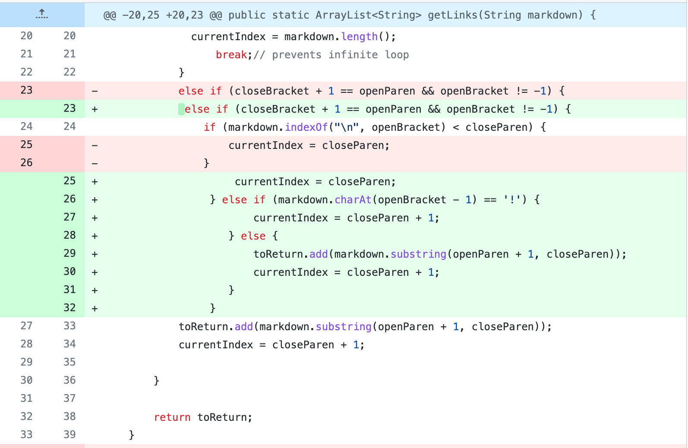

# Lab Report 2 - Week 4

* ## First code changes:

1.  a screenshot of the code change differn from Github

    

2. link to the test file for a failure-inducing input that prompted you to make that change
 
   [test file 1](https://github.com/Eunggseo/markdown-parser/blob/main/test-file.md)

3.  the symptom

     

4. the __symptom__ is there is an infinite loop when there is an empty line(__failure-inducing input__) in test-file.md

   The __bug__ is that it prints out the “link” even when the link is not a valid link.

   If there is no link provided, the code should return null. 

* ## Second code changes:

1.  a screenshot of the code change differn from Github
    

2. link to the test file for a failure-inducing input that prompted you to make that change

   [test file 2](https://github.com/Eunggseo/markdown-parser/blob/main/test-file.md)

3.  the symptom
    

4. The __symptom__ is that spaces and characters in between the [] and () don’t matter as the program runs in between the brackets and parentheses. However, the currentIndex will be shifted over by however many characters you include.(__failure-inducing input__) 

   The __bug__ is no spaces ignored when printing links

   If there have spaces, the code should ignore.

* ## Third code changes:

1.  a screenshot of the code change differn from Github
   

2. link to the test file for a failure-inducing input that prompted you to make that change
 
   [test file 3](https://github.com/Eunggseo/markdown-parser/blob/main/test-file3.md)

3. the symptom  
   

4. The __symptom__ is when there are more than one empty line, we get an index out of bounds error. If there is only one empty line, the code still works and you get back “[]”.(__failure-inducing input__) 

   The __bug__ is that the code should return null
  