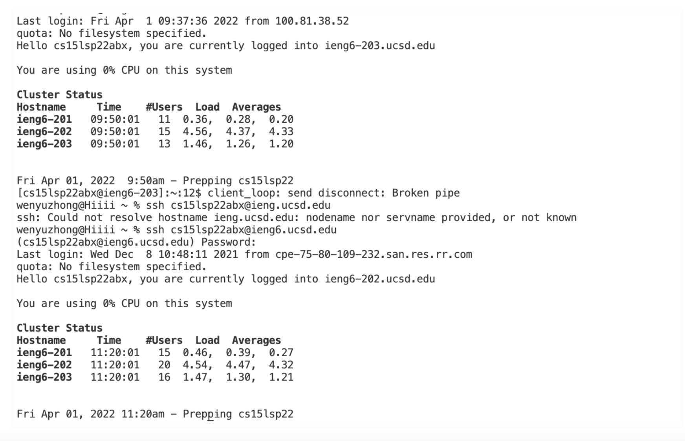
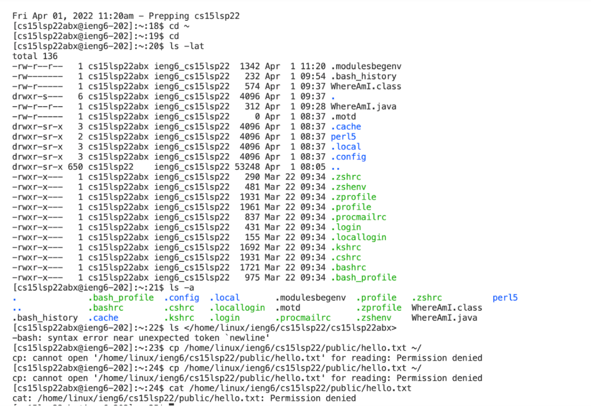
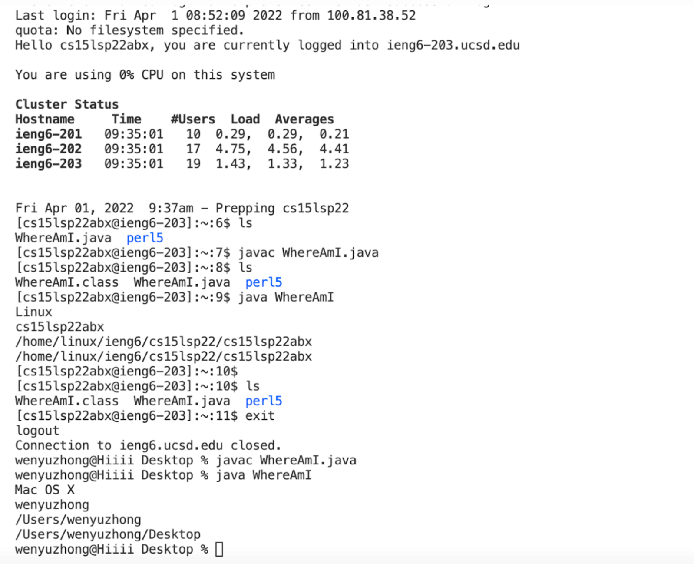
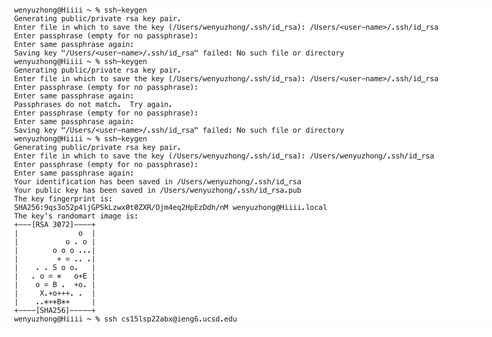
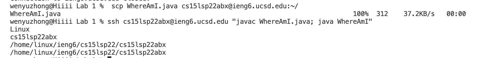

__This is a tutorial about how to log into a course-specific account on ieng6.__

---
## *First step*: Install the Visual Studio Code

Here is the [website](https://code.visualstudio.com/) to download the Visual Studio Code

After you installed susscefully, you will see a screen like this:


 
## *Second step*: Remotely Connecting

* You can find your course-specific account for CSE15L [here](https://sdacs.ucsd.edu/~icc/index.php)

* Open a terminal in VS Code and use this command below (replace the zz with your own account letters.):

  `ssh cs15lsp22zz@ieng6.ucsd.edu`

 * When you see the screenshot like this below, it means your terminal is connected to a coumpter in the CSE basement, also the computer will run the same command as you're doing in your own computer.

 

## *Third step*: Trying Some Commands

You can try different commonds on your computer and the remote one after remote connecting. For example:

* `cd`
* `ls`
*  `cat /home/linux/ieng6/cs15lsp22/public/hello.txt`

You can explore by yourself! Here is a scrrenshot after you run those commands:


Here is a useful Terminal commands [cheatsheet](https://www.makeuseof.com/tag/mac-terminal-commands-cheat-sheet/) for Mac users.

## *Fourth step*: Moving Files with `scp`

If we want to cope a file from our own computer(client) to a remote computer(server), this process is `scp`.

* Create a file and name it WhereAmI.java and paste the following lines:

```
class WhereAmI {

  public static void main(String[] args) {
    System.out.println(System.getProperty("os.name"));
    System.out.println(System.getProperty("user.name"));
    System.out.println(System.getProperty("user.home"));
    System.out.println(System.getProperty("user.dir"));

  }
}
```

* Use `javac` and `java` to compile the file. 

* Then run this commond using your user name in your terminal:

    `scp WhereAmI.java cs15lsp22zz@ieng6.ucsd.edu:~/`

* Enter the password and log into ieng6 with `ssh` again. Use the command ls, then you will see the file in the home directory. 

* Using `javac` and `java` again to run it on your ieng6 computer.



## *Fifth step*: Setting an `SSH` Key

Everytime wehen we need to log in or run `cp`, we have to type our passwords many times. There has a more easier way to solve this problem --  `SSH` Key

Type the code below to help you set up (on client (your computer)):

```
$ ssh-keygen

Generating public/private rsa key pair.

Enter file in which to save the key (/Users/<user-name>/.ssh/id_rsa): /Users/<user-name>/.ssh/id_rsa

Enter passphrase (empty for no passphrase): 
```

You will see a screen like this below:



## *Sixth step*: Optimizing Remote Running

You can come up with your own way to have a most convenient method to make a local edit to your file!

Here is a demo, this is a example using `scp` and `ssh` commands to save time and you only need to run it once:


As the example showed above, you can first write a `ssh` command and ass quotes after it to directly run it on the remote server.

Then you can use semicolons to run multiple commands on the same line in most terminals. 
For this example, we can run commands `javac` and `java` on the same line by using semucolon.

---
**Thank you so much for reading this article!**


