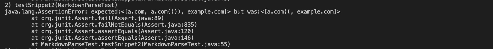

# Lab Report 4

* ### A link to your markdown-parse repository and a link to the one you reviewed in week 7
  [my repository](https://github.com/Eunggseo/markdown-parsenew/tree/main/markdown-parserWenyu)

  [reviewed one]( https://github.com/HantianLin/markdown-parser)
## Expected outputs for all snippets


## **Snippet 1**
```
`[a link`](url.com)

[another link](`google.com)`

[`cod[e`](google.com)

[`code]`](ucsd.edu)
```
* ### Test & JUnit output of running the test(Mine):


* ### Test & JUnit output of running the test(Reviewed):


 ## Snippet 2
 ```
 [a [nested link](a.com)](b.com)

[a nested parenthesized url](a.com(()))

[some escaped \[ brackets \]](example.com)
```
* ### Test & JUnit output of running the test(Mine):


* ### Test & JUnit output of running the test(Reviewed):





 ## Snippet 3
 ```
 [this title text is really long and takes up more than 
one line

and has some line breaks](
    https://www.twitter.com
)

[this title text is really long and takes up more than 
one line](
https://sites.google.com/eng.ucsd.edu/cse-15l-spring-2022/schedule
)


[this link doesn't have a closing parenthesis](github.com

And there's still some more text after that.

[this link doesn't have a closing parenthesis for a while](https://cse.ucsd.edu/


)

And then there's more text
```
* ### Test & JUnit output of running the test(Mine):


* ### Test & JUnit output of running the test(Reviewed):


* ### Do you think there is a small (<10 lines) code change that will make your program work for **snippet 1** and all related cases that use inline code with backticks? If yes, describe the code change. If not, describe why it would be a more involved change.
  My Code:

  Yes. I can get the right outputs exclude "`google.com" by checking whther there has any backticks within the parenthesis to determine the link is invalid or not. 

  Reviewed Code:

  Yes. The other group may get the right outputs exclude "`google.com" by checking whther there has any backticks within the parenthesis to determine the link is invalid or not. 


* ### Do you think there is a small (<10 lines) code change that will make your program work for **snippet 2** and all related cases that nest parentheses, brackets, and escaped brackets? If yes, describe the code change. If not, describe why it would be a more involved change.
   My Code:

   No. I cannot change the code to make it work by editing less than 10 lines. Since the error is quite hard to find and determine which brackets/parenthesis should be used.

  Reviewed Code:

  Yes. The other group may consider the brackets if the next bracket has an opposite facing direction. If-else statement is also a helpful way to solve it. 


* ### Do you think there is a small (<10 lines) code change that will make your program work for **snippet 3** and all related cases that have newlines in brackets and parentheses? If yes, describe the code change. If not, describe why it would be a more involved change.

   My Code:

   No. The change would exceed 10 lines. Since I need to check every line to find a for a close bracket/parenthesis. When coming across a open bracket/parenthesis, everything before needs to be discarded. 

  Reviewed Code:

  No. They may need a more involved change. Since they need to check every line to find a for a close bracket/parenthesis. When coming across a open bracket/parenthesis, everything before need to be discarded. 
