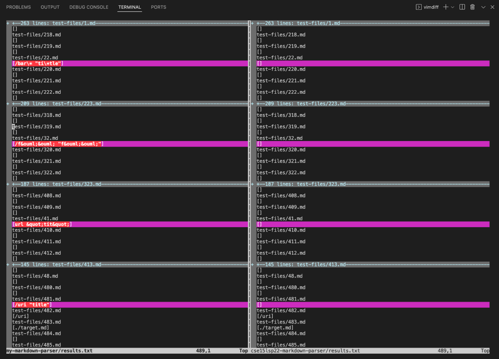
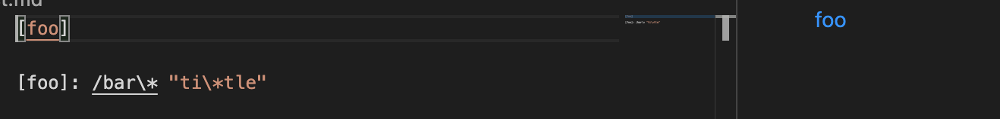
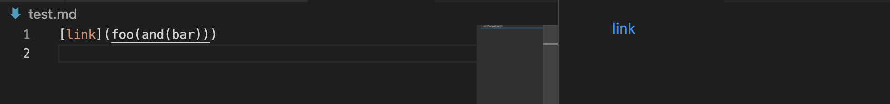
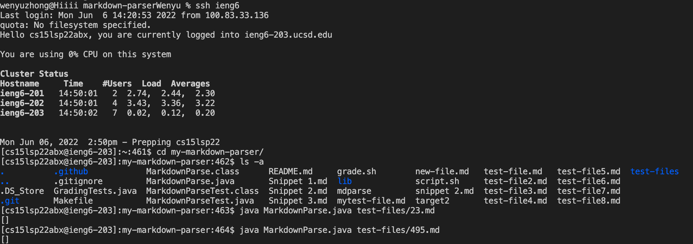
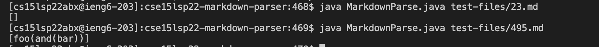
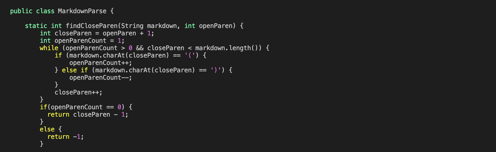

# Lab Report 5 | Week 10

 ## Using `vimdif` command I found the tests with different results
  `vimdiff my-markdown-parser/results.txt cse15lsp22-markdown-parser/results.txt`

  By using the command, we can find the differences between each test.

## Link of Two Tests &  Implementation & Actual Outputs & Expected Outputs

### [Test 23](https://github.com/nidhidhamnani/markdown-parser/edit/main/test-files/23.md)
* Expected Outputs:

(since there are no valid links, though “foo” is shown as link (highlighted in blue) that is not what we are looking for in MarkdownParse and the correct expected output would simply be [].
)
* Implementation: 
Both implementations are correct since there are no valid links, the output should be simply []

### [Test 495](https://github.com/nidhidhamnani/markdown-parser/edit/main/test-files/495.md)
* Expected Outputs:

(since there are no valid links, though “foo(and(bar))” is shown as link (highlighted in blue) that is not what we are looking for in MarkdownParse and the correct expected output would simply be [].
)
* Implementation: 
My implementations is correct since there are no valid links, the output should be simply [].
Provided one is incorrect since we need [] instead of [foo(and(bar))] for this one.

### Actual Outputs:

  * my-markdown-parser with two tests

  * cse15lsp22-markdown-parser with two tests

## The bug & The code should be fixed
* Bug: need [] instead of [foo(and(bar))]
* code: 
First we should check if the links in brackets are valid, with valid link prefixes and suffixes. Secondly for multiple brackets should only deal with the first left bracket and the last right bracket, and all brackets in between should be ignored
